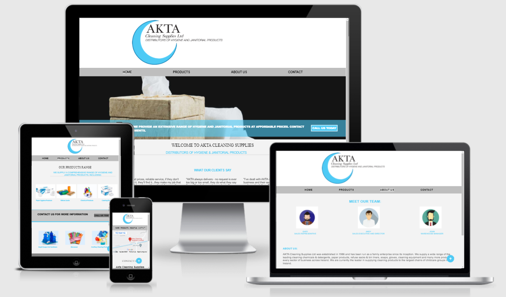
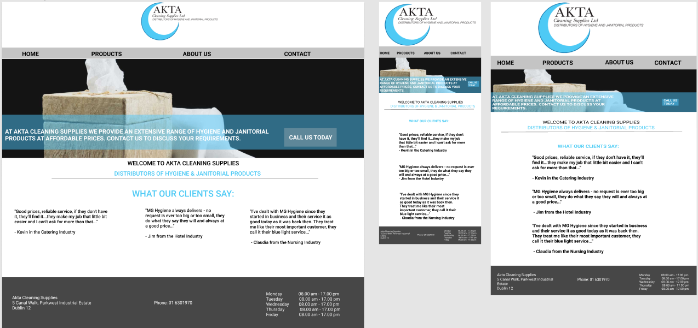
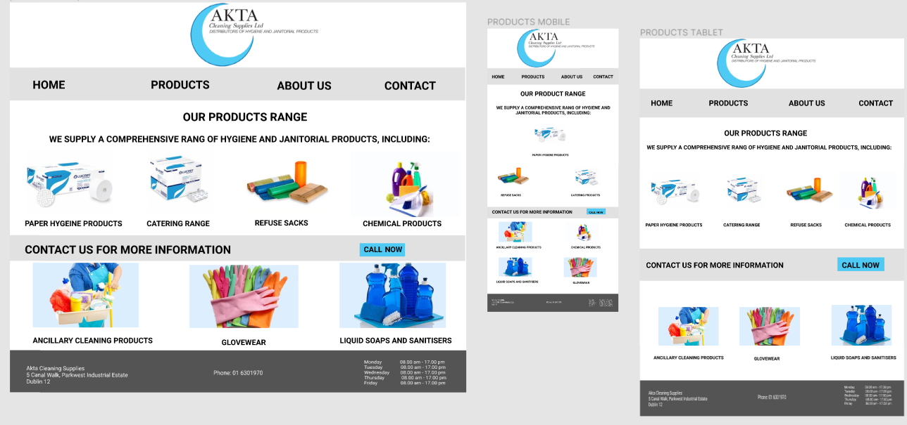
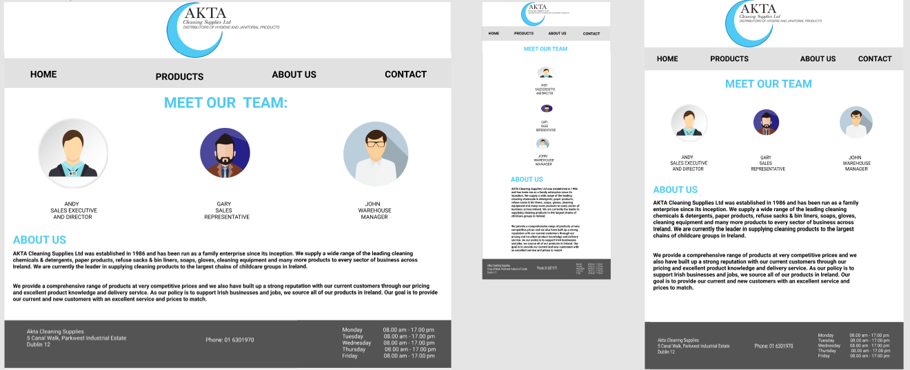
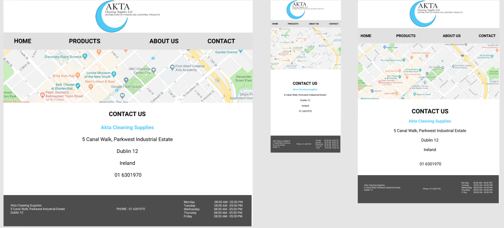

# Akta Cleaning Supplies

 

## [View Live Project](https://eoinc97.github.io/milestone-project-1/)

 

# Table Of Contents
* [UX](#ux)
* [Ideal User Demographic](#IdealUserDemographic)
* [User stories](#user-stories)
    * [Wireframe](#wireframe)
* [Development](#development)
* [Design](#design)
* [Features](#features)
* [Testing](#testing)
* [Technologies Used](#technologiesused)
* [Deployment](#deployment)
* [Validation](#validation)
* [IssuesandBugs](#issuesandbugs)
* [Credits](#credits)

# Introduction

This website was designed for AKTA Cleaning Supplies. The purpose of the website is to be a point of contact for customers and also to find relevant information about the company.

AKTA Cleaning Supplies is a Dublin based company in the Parkwest Industrial Estate, focused mainly on cleaning supplies. 

AKTA was established in 1986 and has been run as a family enterprise since its inception, they supply a wide range of the leading cleaning chemicals & detergents, paper products, refuse sacks & bin liners, soaps, gloves, cleaning equipment and many more products to every sector of business across Ireland.

AKTA are currently a leader in supplying cleaning products to the largest chains of childcare groups in Ireland and provide a comprehensive range of products at very competitive prices and we also have built up a strong reputation with our current customers through our pricing and excellent product knowledge and delivery service. 

This is the first of four Milestone Projects that the developer must complete during their Full Stack Web Development Program at The Code Institute.

The main requirements were to make a responsive and static website with a minimum of three pages using primarily HTML5 and CSS3.

 

# UX

# Ideal User Demographic 
The ideal user demographic would be the hospitality industry, the fitness industry and education to name a few.

These customers for example would require a high volume of cleaning on a regular bases and with that comes the need for a high volume of cleaing supplies and materials. 

 

# User Stories

### New/Potential Customer Goals

1. As a new customer i want to eaily navigate through the website to find relevant content effortlessly

2. As a new customer i want to learn more about the companies background.

3. As a new customer i want to see what products are available.

4. As a new customer i want to know where the business is located and the best way to get in contact

 

# Wireframe
Wireframes were created using figma.com workspace, which provided an excellant user experience. 

This was the end product i came to on my design, I have a second option in which I created which I will put below.

### Home Page

 
 
 

### Products Page

 
 
 

### About Us Page

 
 
 

### Contact Page

 

A couple of changes have had to be made since making these mockups, when going through media queries some elements on smaller screens did not look as I had hoped, so during the process come elements have been removed mainly on mobile devices.

 

### Option 2
This was the first design I came up with, I realised that to look more professional I would have to make the logo look better on the nav bar and also it would have to be on each page to stay consistent, so I went back to the drawing board and came up with my second option which i decided to go ahead with.

 

.png)
.png)
.png)
.png)

 
 

[Back to Table of contents](#table-of-contents)

# Development

In order to create a comprehensive and informative website, I worked closely with the company to distinguish what exactly they were looking for in a website as they were  unhappy with the current one they had. 
 

The main aim of the site was to be easy to navigate, the current site had far to many pages and was quite repetitive, I was tasked with trying to build something that could with some more experience be used as the companies official site.

### strategy

The website will focus on the following audiences:

## Roles
*  current Akta customers
*  previous Akta customers 
*  prospective Akta customers

## Demographic
* Education sector 
* Hospitality industry
* Fitness industry

### This website needs to enable AKTA to:
* develop an online presence
* Provide an easily navigable website for users to find relevant information:
* product information

### This website needs to enable the USER to:
#### Retrieve desired infortmation:
*  contact information 
* find product information
* learn more about the company

 

# Design
### Color Scheme
the main colors used throughout the website are a mixture of Gray, White, and a Light Blue.

the light blue color i have chosen is to match to color used on the logo, i have put certain elements on the site in this color including some headings and block elements.

### Typography 
Arial, Helvetica, sans-serif
The pairing of fonts Arial and Helvetica is used throughout the website with Sans Serif as the fallback font in case of any import failure.

 

### Imagery
The selected images are in relation to the type of company AKTA is, so cleaning supplies were used and images related to cleaning.

All imagery provides alternative text to be used in the event that the element cannot be rendered.

 

# Features

 

## Design Features 

Each page of the site features a consitent Logo, Footer & Navigation system

* the header contains a logo which is placed in the centre of the page (when clicked brings you back to the homepage), underneath this a nav bar is available with four clickable sections, when hovered over they change color and the active page is shown with a solid color surrounding its text.

 

### Home Page 
* The home page contains a background image with text overlay within a banner, the image occupies 100% of the page width some customer review text and a contact button.

* On smaller screens the text overlay and contact button is removed and the image spanning across the screen becomes slightly smaller.

### Background Image
* Spreads out over 100% of the page width, the text overlay has a light blue background and on far right of page there is a call button with a white border surrounding it, when clicked this brings us to the contact page.

 

### Products Page
* T
he products page contains 7 images and pieces of text along with a banner that spreads 100% of the page with a contact button incorperated.

* The top of the page contains a logo and navigation bar and at the botton is a return to top button

 

### About Us Page
* the about us page contains 3 photos of employees and their names and underneath there is some info about the company which give a little bit of a background
* The top of the page contains a logo and navigation bar and at the botton is a return to top button

 

### Contact Page
* The contact page contains a live map taken from Google Maps, below this are some contact details for the company e.g phone number, address.
* The top of the page contains a logo and navigation bar and at the botton is a return to top button
 

 

# Testing

* My testing for the project consisted of alot of trial and error, what i would do is try different things and see how they worked, I would go back to the course work to specific sections relating to the code I was writing for the project.

* I would try little bits of code in the coders coffeehouse code window and also redo some challenges with the code i was using for the project, commenting sections of code in and out was also very helpful to pinpoint certains errors or anything i wasnt happy with.

 

* I would also for some sections, use the "try it yourself" section on w3schools.com, this made it alot easier for me to then implement into my own work the code i had just been practicing ehich I found extremely helpful and informative.

 

* A key test I undertook was suggested by my mentor at the midway point of the project, we talked through certain areas and inspected the code and was suggested to me i should look at flexboxfroggy.com, this was key because it showed me an easy way to space out the images i was applying to the products section.

 

* Flexbox froggy had 24 mini challenges to run through which explained how to apply the code and where it does and doesnt work which I found extremly helpful and has been of huge benefit to me. it was of huge benefit when making the nav bar far more responsive, when i would inspect the page to see the point of where the site would become distorted the first thing to change was the nav bar because i had it set out on margin at first, but with flexfroggy i came to realise i can do this a different way.

 

* I also went back through the "Love Running" section of the course and looked through the videos and was coding along with them again trying different things out to see if it would fit or not which I found very helpful.

 

[Back to Table of contents](#table-of-contents)

# Technologies Used

## Main Languages Used

* HTML5
* CSS

## Frameworks, Libraries & Programs Used

* Font Awesome

* Figma

* Flexbox Froggy

* W3Schools

* Gitpod

* Github

# Issues and Bugs

### Google Maps 
* A bug where when the link for the location of Akta Cleaning Supplies wouldnt load in the page when applied, i tried the iframe used in the coders coffeehouse and this worked perfect, with abit of trial and error this was resolved.

### Navigation Bar
* issue where how i had it set up with using margin the nav bar wasnt very responsive, i changed this by using flex which then brought up another issue relating to padding.

* I had padding around each option which pushed the writing down so the names of the sections were not in line with eachother, i rectified this by changing the padding and the margins used. 

* this has made the the page that is active have a more minmal color around its name and also when hovered over it is more neat, this is to counteract the words beings out of line which adding in display: flex; has caused.

### Footer 
* Same issue as above, footer was not responsive, when screensize would change text would bcome very distorted and change position, I was also
having a constant issue of text aligning when lined up to the left it looks distorted, the days that are spelt longer was pushing the time further away if i had text aligned to the left when aligned right this wasnt the case.

### Media Queries
* issue where on media queries if certain properties were used that were being reused and changed from the original css the changes would not implement at smaller screen sizes, e.g if font size was used in a class then the use of a smaller font wouldnt be implemented in the media querie.

* I rectified this by adding !important to overide the inline css so the changes could be made to make my site more responsive at smaller screen sizes. This was the only solution I could come up with, I spent alot of time going through videos and articles not finding exaclty what i needed, 

### Images not loading
* I had a slight bug on deployed site where the images were not showing, i went back into my code and copied the relative file paths this rectified the issue i was having.

  

 # Validation

 * Ran through validation with mentor on final call, we worked through any errors that came up and we left the call happy 

 * Validator used was https://validator.w3.org/#validate_by_input   https://jigsaw.w3.org/css-validator/

* https://validator.w3.org/nu/?doc=https%3A%2F%2Feoinc97.github.io%2Fmilestone-project-1%2Findex.html&showsource=yes

 

# Deployment
The project was deployed on GitHub Pages. I used Gitpod as a development environment where I commited all changes to git version control system. I used push command in Gitpod to save changes into GitHub.

To deploy a project i had to: 
* log into Github and click on the depository I was deploying
* then select settings and scroll down to git hub pages, this brings you to a seperate window.
* Fom source select none and then Milestone-Projects branch.
* Click save and page was deployed after auto-refresh.

To run localy:

* Log in to GitHub and click on repository to download (MP1)
* select Code and click Download the ZIP file.
* after download you can extract the file and use it in your local environment

# Credits

* https://www.w3schools.com/

* youtube.com

* http://flexboxfroggy.com/

* https://www.aktacleaningdublin.com/

* Background image was taken from the AKTA website and url link used in css code.

### Map
* google.com

 

[Back to Table of contents](#table-of-contents)

